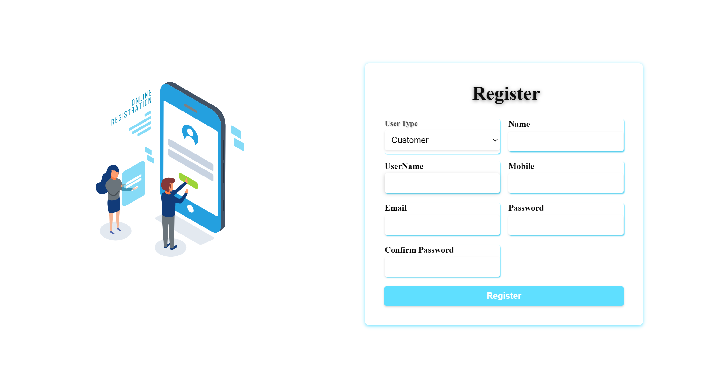

# On_Road_Vehicle_Breakdown_Assisstance





This MERN stack application helps users find mechanics near them when their vehicle breaks down. Users can book a mechanic, track the mechanic's location, and manage requests. Mechanics can toggle their availability and manage incoming service requests.


## Table of Contents

- [Features](#features)
- [Technologies Used](#technologies-used)
- [Installation](#installation)
- [Usage](#usage)
- [Project Structure](#project-structure)
- [Future Enhancements](#future-enhancements)
- [Contributing](#contributing)
- [License](#license)
- [Contact](#contact)

## Features

- **User Registration**: Users can register as a customer or a mechanic.
- **Mechanic Availability**: Mechanics can toggle their availability status.
- **Service Requests**: Customers can submit a request for vehicle assistance.
- **Real-time Tracking**: Customers can track the mechanic's location after booking.
- **Mechanic Dashboard**: Mechanics can view and manage new service requests.
- **Notifications**: SMS notifications for mechanics via Twilio (optional).
- **Responsive UI**: The app layout adjusts for different screen sizes.

## Technologies Used

- **Frontend**: React.js, Material-UI
- **Backend**: Node.js, Express.js
- **Database**: MongoDB (with Mongoose)
- **Authentication**: JWT (JSON Web Token)
- **Notifications**: Twilio SMS API (optional)
- **State Management**: React hooks
- **Styling**: CSS, Material-UI

## Installation

1. **Clone the repository**:
    ```bash
    git clone https://github.com/your-username/vehicle-breakdown-assistance.git
    cd vehicle-breakdown-assistance
    ```

2. **Install dependencies**:

    - Backend:
      ```bash
      cd backend
      npm install
      ```

    - Frontend:
      ```bash
      cd frontend
      npm install
      ```

3. **Environment Variables**:

   Create a `.env` file in the `backend` directory with the following environment variables:

    ```bash
    MONGO_URI=<Your MongoDB URI>
    JWT_SECRET=<Your JWT Secret>
    TWILIO_ACCOUNT_SID=<Your Twilio Account SID>
    TWILIO_AUTH_TOKEN=<Your Twilio Auth Token>
    TWILIO_PHONE_NUMBER=<Your Twilio Phone Number>
    ```

4. **Run the Application**:

    - Backend:
      ```bash
      cd backend
      npm start
      ```

    - Frontend:
      ```bash
      cd frontend
      npm start
      ```

5. **Access the app**:

   - Frontend: `http://localhost:3000`
   - Backend API: `http://localhost:5000`

## Usage

1. **Registration**: Customers and mechanics can register via the registration page.
2. **Login**: Log in to the platform to access the dashboard.
3. **Customer Features**: Customers can submit requests and track their mechanic.
4. **Mechanic Features**: Mechanics can toggle availability, receive requests, and manage them via their dashboard.

## Project Structure

├── backend # Backend code (Node.js, Express.js) │ ├── controllers # Business logic for API routes │ ├── models # Mongoose models for MongoDB │ ├── routes # API routes for requests │ ├── middleware # Middleware for authentication │ └── server.js # Main entry point for the backend server ├── frontend # Frontend code (React.js) │ ├── src │ │ ├── components # Reusable React components (UI) │ │ ├── pages # React pages for different routes │ │ ├── hooks # Custom React hooks │ │ └── utils # Helper functions ├── .gitignore # Files and directories to be ignored by Git ├── README.md # Project documentation └── package.json # Dependencies and project scripts


## Future Enhancements

- **Payment Integration**: Add payment gateways for customer convenience.
- **Real-Time Notifications**: Implement live notifications for both customers and mechanics.
- **Review System**: Allow customers to rate and review mechanics.
- **Push Notifications**: Add support for push notifications for mobile users.

## Contributing

Contributions are welcome! To contribute:

1. Fork the repository.
2. Create a new feature branch:
    ```bash
    git checkout -b feature-branch-name
    ```
3. Commit your changes:
    ```bash
    git commit -m "Add some feature"
    ```
4. Push to the branch:
    ```bash
    git push origin feature-branch-name
    ```
5. Open a pull request.

## License

This project is licensed under the MIT License - see the [LICENSE](LICENSE) file for details.

## Contact

- **Author**: Nageswarrao
- **Email**: vnr235@gmail.com


